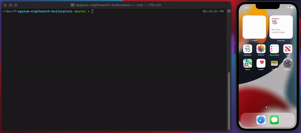

# Apppium-Nightwatch-Examples
Appium is an open source tools that help you drive your mobile apps(native, hybrid, and mobile web). At a high-level appium works on client-server architecture. 
Appium server is Node JS based web server that exposes REST APIs and bridges command to native frameworks.
## Overview
The aim of the repo is to demonstrate features of Nightwatch which will be useful for writing testcases for mobile devices.

## Demo



## Setup

1. To run tests locally on mobile devices we need to [download and setup Appium](https://appium.io/docs/en/about-appium/getting-started/?lang=en#installing-appium). 
2. Now that you have installed Appium, run the appium server using command:
```sh
$ appium
```
3. clone the repository:
```sh
$ git clone 
```
4. Install the dependencies
```sh
$ npm install
```
5. To run on Lambdatest
### Setting Up Your Authentication

Make sure you have your LambdaTest credentials with you to run test automation scripts on LambdaTest. To obtain your access credentials, [purchase a plan](https://billing.lambdatest.com/billing/plans?utm_source=github&utm_medium=repo&utm_campaign=LT-appium-java) or access the [Automation Dashboard](https://appautomation.lambdatest.com/?utm_source=github&utm_medium=repo&utm_campaign=LT-appium-java).

Set LambdaTest `Username` and `Access Key` in environment variables.

**For Linux/macOS:**

```js
export LT_USERNAME="YOUR_LAMBDATEST_USERNAME" \
export LT_ACCESS_KEY="YOUR_LAMBDATEST_ACCESS_KEY"
```

**For Windows:**

```js
set LT_USERNAME="YOUR_LAMBDATEST_USERNAME" `
set LT_ACCESS_KEY="YOUR_LAMBDATEST_ACCESS_KEY"
```

### Upload Your Application

Upload your **_iOS_** application (.ipa file) or **_android_** application (.apk file) to the LambdaTest servers using our **REST API**. You need to provide your **Username** and **AccessKey** in the format `Username:AccessKey` in the **cURL** command for authentication. Make sure to add the path of the **appFile** in the cURL request. Here is an example cURL request to upload your app using our REST API:

**Using App File:**

**Linux/macOS:**

```js
curl -u "YOUR_LAMBDATEST_USERNAME:YOUR_LAMBDATEST_ACCESS_KEY" \
--location --request POST 'https://manual-api.lambdatest.com/app/upload/realDevice' \
--form 'name="Android_App"' \
--form 'appFile=@"/Users/macuser/Downloads/proverbial_android.apk"'
```

**Windows:**

```js
curl -u "YOUR_LAMBDATEST_USERNAME:YOUR_LAMBDATEST_ACCESS_KEY" -X POST "https://manual-api.lambdatest.com/app/upload/realDevice" -F "appFile=@"/Users/macuser/Downloads/proverbial_android.apk""
```

**Using App URL:**

**Linux/macOS:**

```js
curl -u "YOUR_LAMBDATEST_USERNAME:YOUR_LAMBDATEST_ACCESS_KEY" \
--location --request POST 'https://manual-api.lambdatest.com/app/upload/realDevice' \
--form 'name="Android_App"' \
--form 'url="https://prod-mobile-artefacts.lambdatest.com/assets/docs/proverbial_android.apk"'
```

**Windows:**

```js
curl -u "YOUR_LAMBDATEST_USERNAME:YOUR_LAMBDATEST_ACCESS_KEY" -X POST "https://manual-api.lambdatest.com/app/upload/realDevice" -d "{"url":"https://prod-mobile-artefacts.lambdatest.com/assets/docs/proverbial_android.apk","name":"sample.apk"}"
```

**Tip:**

- If you do not have any **.apk** or **.ipa** file, you can run your sample tests on LambdaTest by using our sample :link: [Android app](https://prod-mobile-artefacts.lambdatest.com/assets/docs/proverbial_android.apk) or sample :link: [iOS app](https://prod-mobile-artefacts.lambdatest.com/assets/docs/proverbial_ios.ipa).
- Response of above cURL will be a **JSON** object containing the `App URL` of the format - <lt://APP123456789123456789> and will be used in the next step.

## Configuration

We can add in a test setting in nightwatch config for appium server and then can extend for various desired target-devices/desired-capabilites(https://www.lambdatest.com/capabilities-generator/  ) to run on:

```js
'appium': {
      selenium: {
        host: 'mobile-hub.lambdatest.com/wd/hub',
        port: 80
      },
      desiredCapabilities: {
        'lt:options': {
          username: '${LT_USERNAME}',
          accessKey: '${LT__ACCESS_KEY}'
        }
      },
      disable_error_log: true,
      webdriver: {
        timeout_options: {
          timeout: 150000,
          retry_attempts: 3
        },
        keep_alive: true,
        start_process: false
      }
    },
    
    'appium.ios13': {
      extends: 'appium',
      desiredCapabilities: {
       // browserName: 'Safari',
        javascriptEnabled: true,
        platformName: 'ios',
        platformVersion: '15.0',
        deviceName: 'iPhone 13',
        isRealMobile: true,
        user: '${LT_USERNAME}',
        accessKey: '${LT__ACCESS_KEY}',
        app: "lt://APP10160621161658226142499826" // path for the ios app you want to test
      }
    },
```

6. Run the test
```sh
$ npm test
```

